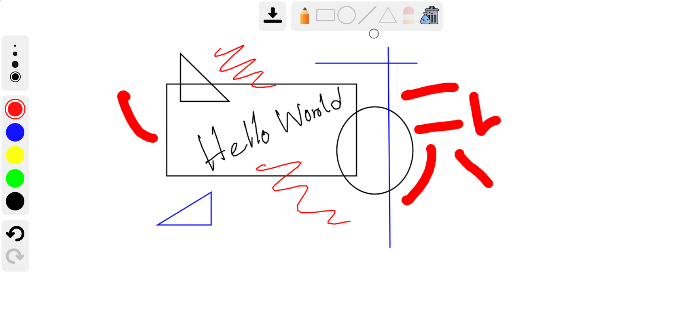

# PokeDraw: Lightweight Drawing App
PokeDraw is a lightweight drawing application built with HTML5 Canvas. It's ideal for quick sketches and drawings and is inspired by the Microsoft Whiteboard.

## Features

- **Pen Tool:** Freehand drawing.
- **Eraser Tool:** Remove strokes effortlessly.
- **Fill Tool:** Flood fill areas with color.
- **Shape Tools:** Draw rectangles, circles, lines, and triangles.
- **Undo/Redo:** Easily revert or reapply changes.
- **Clear Function:** Reset the canvas.

## Getting Started

1. Open the app in your browser.
2. Choose a tool from the toolbar.
3. Start drawing on the canvas.

## Notes

- Built using modern HTML5 Canvas technologies.
- Optimized for desktop use.